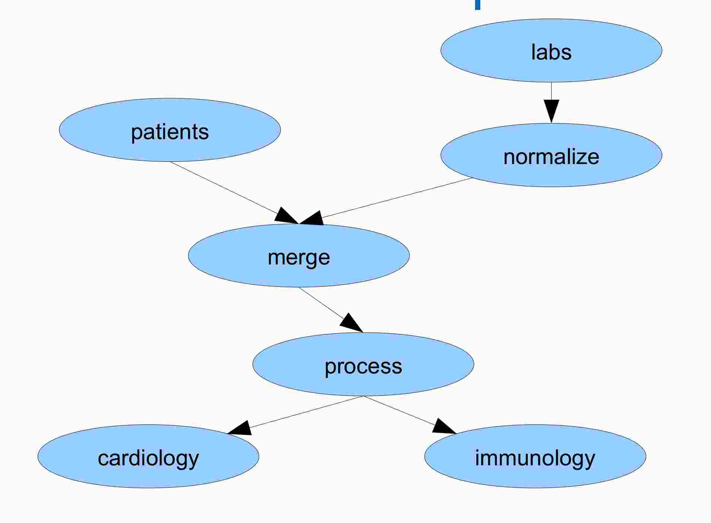

<!-- pandoc -t revealjs -s -o mitre-rdf-pipeline-fhir-lib.md.html --filter pandoc-include mitre-rdf-pipeline-fhir-lib.md -V revealjs-url=../../slides/reveal.js -->
<!-- .html.md: pandoc -t revealjs -s -o mitre.md.html mitre-rdf-pipeline-fhir-lib.md -V revealjs-url=../../slides/reveal.js -->

## Table of Contents

* Who's Carif? (4m)

* What's the RDF Pipeline project? (5m)

* A Tale of Two Translators (16m)


## Carif Bio Timeline (2m)

* BA Math Boston College, MS CS Boston University, MBA candidate at Babson

* Systems, AI, Financial Reporting at Digital Equipment Corporation

* Internet startups: OpenMarket, Wandrian, Pazien

* Journalist/Webmaster at CIO Communications 

* Problem Solver for Hire

* Sometime manager, player/coach


## Carif Bio Skillset (2m)


* Linux, TCP/IP, C/C++/python3; bash + packaging

* Dev side of devops (git, Jenkins, AWS, K8s)

* Webapps in various platforms (latest: MEAN)

* Writing; Scrum (standup, jira, etc)

* Database, SQL and NoSQL

* First gen AI (expert systems, knowledge representation, LISP, scheme)

* Calculus, Linear Algebra as needed

* Java/Scala/Clojure + JVM

* Windows C# + .Net


## RDF Pipeline (3m)

* VA funded investigation to apply [dataflow programming](https://en.wikipedia.org/wiki/Dataflow_programming) to clinical data integration using VistA as the data source.

* The [RDF pipeline's](http://dbooth.org/2013/dils/pipeline/Booth_pipeline.pdf) features are:

  * distributed (across machines)
  
  * opportunistic control (computation done when data arrives)
  
  * message passing (nodes/workers communicate along edges/channels)
  
  * RDF (Turtle) describes the pipeline.
  
  * Typed data passes through the nodes
  
* Rich model, ambitious project.

## RDF Pipeline Example (1m)




## Highlights (2m)

* RDF Pipeline: big project, dataflow, graphs described with turtle, nodes do the processing

* Nodes can be written in anything that uses `stdin/stdout/stderr`

  - can be written with "classic" skills in say javascript over nodejs
  
  - can use more sophisticated pattern matching
  
  - some nodes have state, some change formats, e.g. Vista -> FHIR


## A Tail of Two Transators (2m)

* Claim: pipeline node/process can be written any way. Bake-off!

* A classic ["functional" transformer](https://github.com/rdf-pipeline/translators/tree/master/src/js/translate) (Vista object -> FHIR object) done by me.

* A [pattern matcher](https://github.com/rdf-pipeline/translators/tree/master/src/shex) using [Shape Expressions](http://shex.io/shex-primer/index.html) done by [Eric Gordon Prud'hommeaux](https://www.w3.org/People/Eric/)

## Functional Transformer (2m)

* Pro: no specialized knowledge beyond javascript 5.1 or es2016 (need some advanced topics: closures, functional programming with underscore).

* Con: some "advanced" concepts (closures, first class functions, `map`)

* Con: underscore (lib) and JSONPath (pattern access in JSON)

* Pro: Write your own translator by example

* Con:

  - single direction (vista->FHIR one function, FHIR->vista is another)
  
  - works best with 1-1 translations (e.g. `chcss:Patient-2` -> FHIR `Patient`)
  
## Example `chcss:Patient-2` -> FHIR `Patient` (2m)

```json
{
  "type": "chcss:Patient-2",
  "_id": "2-000007",
  "patient_ssn-2": "777777777",
  "street_address-2": "100 MAIN ST",
  "city-2": "ANYTOWN",
  "zip_code-2": "60040",
  "state-2": "NY/USA",
  "label": "BUNNY,BUGS",
  "registration_comment-2": "fake text",
  "name-2": "BUNNY,BUGS DOC",
  "phone-2" : "555 555 5555",
  "office_phone-2" : "555 555 5556",
  "temporary_phone-2" : "555 555 5555",
  "fax_number-2" : "555 555 5556",
  "email_address-2" : "bugs.bunny@looneytun.es",
  "ssn-2": "777777777",
  "dod_id_-2": "7777777770",
  "sex-2": {
  "id": "chcss:2__02_E-MALE",
  "label": "MALE"
  },
  "marital_status-2": {
    "id": "11-2",
    "label": "DIVORCED"
  }, ...
```
  
## ... translated to FHIR ... (2m)

```json
{
  "resourceType": "Patient",
  "id": "urn:local:fhir:Patient:2-000007",
  "identifier": [
    {
      "use": "usual",
      "type": {
        "coding": [
            {
              "code": "chcss",
              "display": "chcss"
            }
        ],
        "text": "777777777"
      },
      "value": "777777777"
    }
   ],
   "name": {
     "use": "usual",
     "family": [
        "BUNNY"
     ],
     "given": [
       "BUGS DOC"
     ]
   },
   "gender": "male",
   "birthDate": "01-01-1990",
   "address": [
     {
       "resourceType": "Address",
       "type": "postal",
       "line": [
          "100 MAIN ST"
       ],
       "city": "ANYTOWN"
     }
   ],
   "maritalStatus": {
     "coding": [
       {
          "system": "http://hl7.org/fhir/marital-status",
          "code": "D",
          "display": "D"
       }
     ],
   "text": "D"
   }
}, ...
```

## ... code (condensed, 3m)  

```js

function simpleTranslate(chcsPatientObject, get) {
    // The get function knows how to get values from chcsPatientObject using JSONPath.
    var get = get || Fdt.makeGetter(chcsPatientObject);

    // Translate the structure. FHIR keys that aren't translated are
    // retained as comments. They may be included later as the author
    // learns more.
    
    var result = Fdt.clean({
        resourceType: RESOURCE_TYPE,
        id: Fdt.fhirId(RESOURCE_TYPE, get('$._id')),
        active: true, // if the patient's chcs record is available, it's active
        identifier: Fdt.fhirIdentifier(get("$['ssn-2']"), get("$['dod_id_-2']")),
        name: Fdt.fhirHumanName(get("$['name-2']") || get('$.label')),  
        // fhir telecom
        telecom: [
            Fdt.fhirContactPoint({system: 'phone', use: 'home', value: get("$['phone-2']") }),
            Fdt.fhirContactPoint({system: 'phone', use: 'office', value: get("$['office_phone-2']")}),
            Fdt.fhirContactPoint({system: 'phone', use: 'mobile', value: get("$['cell_phone-2']")}),
            Fdt.fhirContactPoint({system: 'phone', use: 'temp', value: get("$['temporary_phone-2']")}), // no data in chcs database
            Fdt.fhirContactPoint({system: 'fax', value: get("$['fax_number-2']")}), // no data in chcs database
            Fdt.fhirContactPoint({system: 'email', value: get("$['email_address-2']")}) // no data in chcs
        ],
        gender: Fdt.fhirPatientGender(get("$['sex-2']")),
        birthDate: Fdt.fhirPatientBirthDate(get("$['dob-2']")),
        // fhir address
        address: [ Fdt.fhirAddress({
            street1: get("$['street_address-2']"),
            street2: get("$['street_address-2-2']"),
            street3: get("$['street-address-2-3']"),
            city: get("$['city-2']"),
            state: Fdt.fhirPatientState(get("$['state-2']")),
            country: Fdt.fhirPatientCountry(get("$['state-2']")),
            county: get("$['county-2']"),
            zip: get("$['zip_code-2']")
        }) ],
        maritalStatus: Fdt.fhirMaritalStatus(get("$['marital_status-2']")),
        contact: Fdt.clean([
            { // A contact party (e.g. guardian, partner, friend) for the patient
                relationship : [ Fdt.fhirCodeableConcept(get("$['erelationship-2']")) ], // The kind of relationship
                name: Fdt.fhirHumanName(get("$['emergency_contact-2']")), // A name associated with the contact person
                telecom: [ Fdt.fhirContactPoint({system: 'phone', value: get("$['ephone-2']")}) ], // A contact detail for the person
                address: Fdt.fhirAddress({
                    street1: get("$['estreet_address-2']"),
                    street2: get("$['estreet_address_2-2']"),
                    street3: get("$['estreet_address_3-2']"),
                    city: get("$['ecity-2']"),
                    state: get("$['estate-2']"),
                    zip: get("$['ezip-2']")
                }) // Address for the contact person
                // gender: "<code>", // male | female | other | unknown
                // organization: { Reference(Organization) }, // C? Organization that is associated with the contact
            }
        ]),
        communication: [ Fdt.fhirCodeableConcept('English')],
        // fhir careProvider
        careProvider: [Fdt.fhirReferencePractioner(get("$['health_care_provider-2']"))],
        // fhir managingOrganization -- VA
        managingOrganization: Fdt.fhirReferenceOrganization({
            name: get("$['health_care_provider-2']")
        }),
        // fhir link
        link: [ {other: Fdt.fhirReferencePatient(get("$['correct_patient-2']")), type: 'replace'} ]
    });
    return result;
}
```

## Observations (2m)

* Functional tranlators used [JSONPath](https://github.com/json-path/JsonPath) to dig into the input structure for values.

* Two passes:

  - All FHIR attributes are created but populated with `null`
  
  - All `null` valued pairs are removed
  
* Every supported FHIR "concept" had an associated function, e.g. `Fdt.fhirMaritalStatus`

## Pattern Matcher (2m)

* Pro: Bi-direction (chcss <-> FHIR) with the same mapping `.shex` file

* Pro: Could report "well-formedness" in addition to transformations.

* Pro: Dense and declarative mapping.

* Con: A new language (including syntax and semantics)

## Same Example As Above (2m)

```js
PREFIX fhir: <http://hl7.org/fhir/> 
PREFIX fhirvs: <http://hl7.org/fhir/ValueSet/>
PREFIX Map: <http://shex.io/extensions/Map/#>
PREFIX dem: <urn:local:Demographics:>
PREFIX xsd: <http://www.w3.org/2001/XMLSchema#> 
BASE <http://hl7.org/fhir/shape/>

start=@<Patient>                         # AND {fhir:nodeRole [fhir:treeRoot]}

<Patient> CLOSED {
    a [fhir:Patient];
    fhir:nodeRole [fhir:treeRoot]?;


    # fhir:Patient.identifier @<Identifier>*;    # An identifier for this patient
    fhir:Patient.identifier  {
    a [fhir:Identifier]?;
      fhir:Identifier.system    { fhir:value IRI %Map:{ dem:constIdentifierSysChcs %} };
      fhir:Identifier.value     { fhir:value xsd:string  %Map:{ dem:id %} };
    }*;

    # fhir:Patient.name @<HumanName>*;          # A name associated with the patient
    fhir:Patient.name { 
       fhir:HumanName.use    { fhir:value xsd:string? %Map:{ dem:constNameUse %} };
       fhir:HumanName.text   { fhir:value xsd:string? %Map:{ dem:patient_label %} };
    }*; 

```


## Conclusions (1m)

* Mere mortals can map legacy data structures to FHIR using one of several techniques.

* Direct transformations can get the job done.

* Pattern matching can make the job easier.
